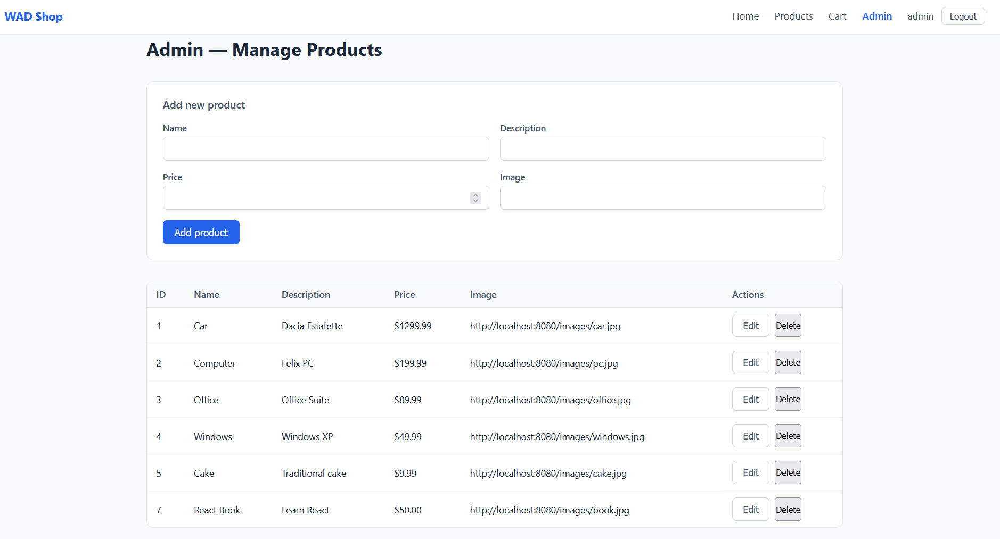
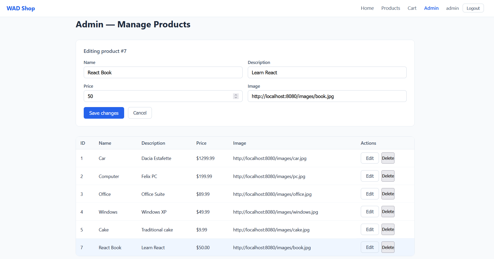
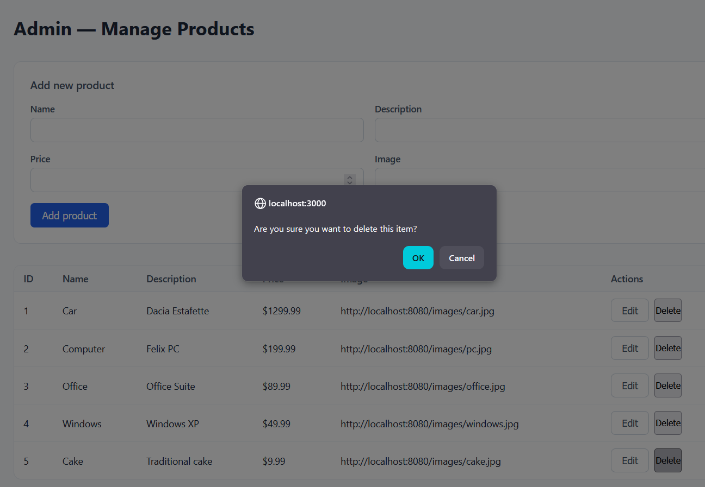

WAD Lab5
```
Backend-SpringBoot http://localhost:8080
Frontend-React http://localhost:3000
```

Features added from Lab4:
```
    -products are stored in a postgres container in Docker
    -SpringSecurity is implemented using JWT such that we have 2 types of user: ADMIN,USER. The pages that can be accessed based on user type are: 
        ->Unlogged user: Home,Login
        ->Logged in USER: Home,Login,Products,Cart
        ->ADMIN: Home,Login,Products,Cart,Admin
```

Backend structure
```
backend/src/main/java/com/wad/ecommerce/
├── config/
│   ├── SecurityConfig.java         Spring Security — JWT filter chain, CORS, endpoint permissions, creates users
│   └── DataLoader.java             seeds the database with products on first startup
├── controller/
│   ├── AuthController.java         validates credentials, returns JWT token
│   ├── ProductController.java      CRUD Mapping
│   └── CartController.java         GET Mapping 
├── model/
│   └── Product.java                JPA entity mapped to the products table
├── repository/
│   └── ProductRepository.java      database access for products
├── security/
│   ├── JwtUtil.java                generates and validates JWT tokens
│   └── JwtFilter.java              intercepts every request and authenticates via Bearer token
├── resources/
│   ├── application.properties      database URL, JWT secret
│   └── static/images/              product images served at http://localhost:8080/images/*.jpg
└── EcommerceApplication.java       
```

Frontend structure
```
frontend/src/
├── components/
│   ├── Navbar/
│   │   ├── index.js
│   │   ├── Navbar.jsx              navbar
│   │   └── Navbar.module.css
│   ├── Product/
│   │   ├── index.js
│   │   ├── Product.jsx             
│   │   └── Product.module.css
│   └── CartItem/
│       ├── index.js
│       ├── CartItem.jsx            
│       └── CartItem.module.css
├── pages/
│   ├── HomePage/
│   │   ├── index.js
│   │   ├── HomePage.jsx            landing page 
│   │   └── HomePage.module.css
│   ├── LoginPage/
│   │   ├── index.js
│   │   ├── LoginPage.jsx           login form 
│   │   └── LoginPage.module.css
│   ├── ProductList/
│   │   ├── index.js
│   │   ├── ProductList.jsx         
│   │   └── ProductList.module.css
│   ├── CartPage/
│   │   ├── index.js
│   │   ├── CartPage.jsx            
│   │   └── CartPage.module.css
│   └── AdminPage/
│       ├── index.js
│       ├── AdminPage.jsx           ADMIN only — table with add, edit, delete for products
│       └── AdminPage.module.css
├── services/
│   ├── auth.service.js             login, logout, token/role storage in localStorage, authHeader()
│   ├── product.service.js          getProducts, createProduct, updateProduct, deleteProduct
│   ├── cart.service.js             addToCartApi
│   └── order.service.js            API calls to place order and see orders 
├── ProtectedRoute.jsx              redirects to /login if not authenticated
├── App.jsx                         cart state, auth state, all handlers, routes
└── App.css                         
```

Lab activity (follow TO-DOs in code):
1. Change docker-compose.yml such that it fits your credentials
2. Implement CRUD in the admin page. (start from product.service.js) The admin should be able to:
   a. see all products (including their id), in a table, that also have an Action column with buttons for Edit/Delete each product
   b. add products in the database (using a form)
   c. edit products (using a form + button from table)
   d. delete products (using a button from table)
3. Add a cancel button that will empty the form when editing a product (start from AdminPage.jsx)
4. Add a confirm window for deleting a product (start from AdminPage.jsx)
5. Create a new table in the database that will be used to store the orders. An order is composed of the username (of the person that places the order), the CartItems (+quantities) and the total price. The itmes will be saved when a user presses Checkout in the Cart page (start at OrderController.java)
6. Admin users should be able to also see the orders in the admin page (start at OrderController.java)

Admin page examples:   

edit product

delete product

orders


